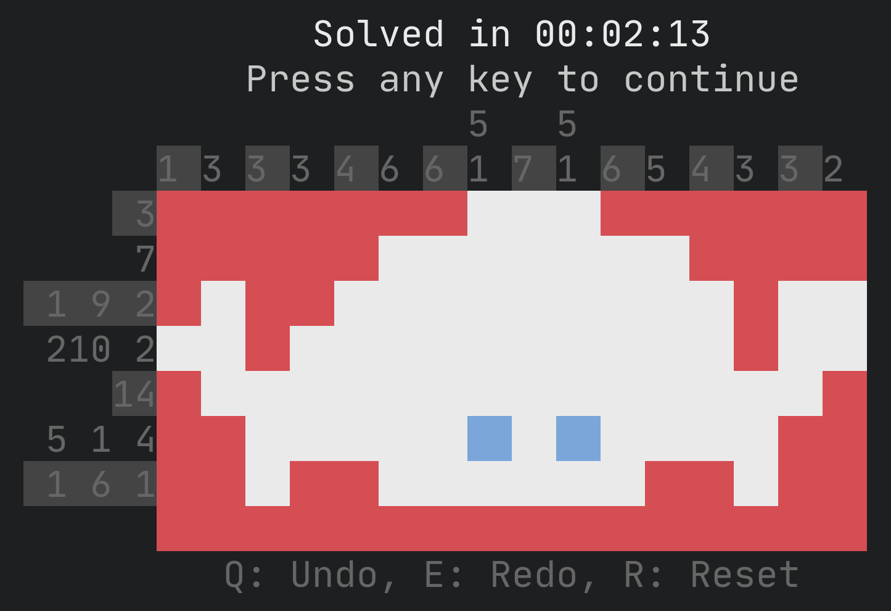

# img2yaya - generate yayagram files from images



[Yayagram](https://github.com/r00ster91/yayagram) is a super neat nonogram puzzle game for the terminal. It either generates random girds or loads predefined girds from a file. It even features an editor to easily create your own grids. But let's be honest, creating grids isn't as much fun as playing them.

This is where img2yaya becomes handy. It automatically generates grids from images with the desired dimensions in just a couple of seconds.

## Installation

```sh
cargo install --git https://github.com/AaronErhardt/img2yaya
```

## Usage

+ Print help

```sh
img2yaya input.png
```

+ Read image and output yayagram to stdout

```sh
img2yaya input.png
```

+ Read image and output yayagram to file

```sh
img2yaya input.png output.yaya
```

+ Additionally set threshold for filling cells to 50 (0-255), invert colors and set grid width to 20

```sh
img2yaya input.png output.yaya -t 50 -i -w 20
```